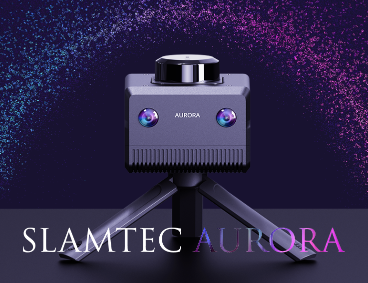
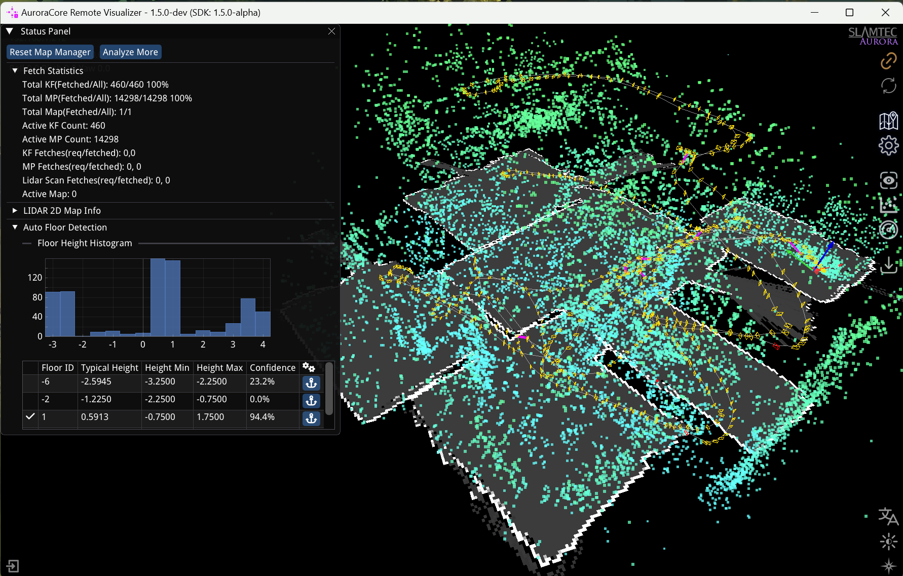
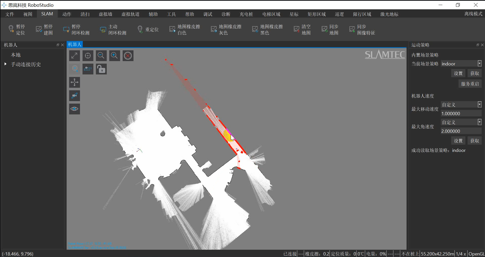
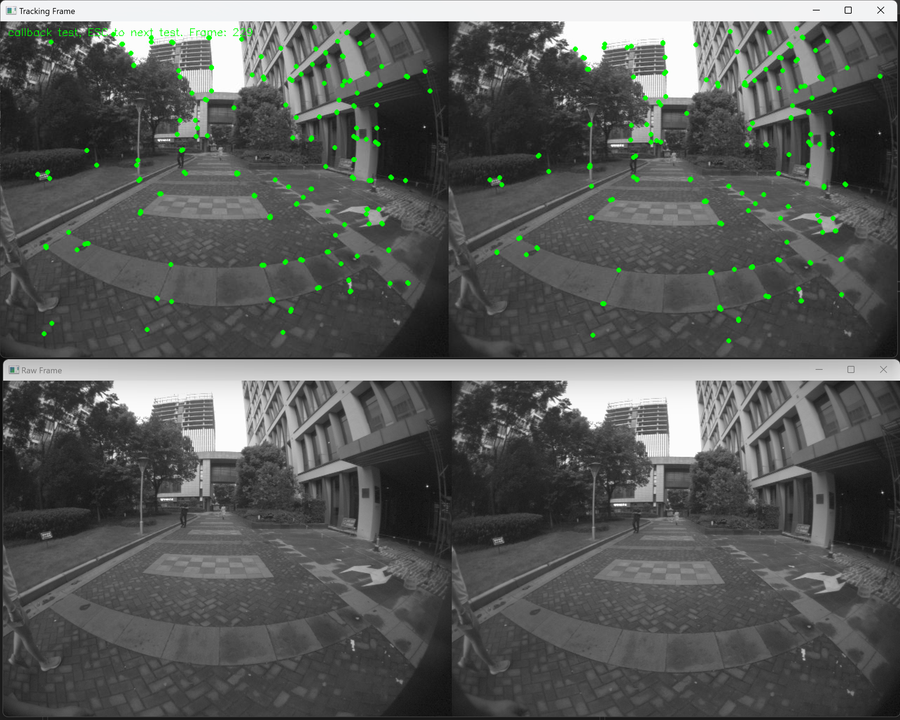

# SLAMTEC Aurora Remote SDK and Demo

([中文版点此](README.zh-CN.md))




This repository contains the Demo code and project skeleton for using the SLAMTEC Aurora Remote SDK.


## Prerequisites
- SLAMTEC Aurora Device
- WiFi or Ethernet connection between the device and the host machine

## Prerequisites for Building
- CMake 3.12 or above
- C++14 Compiler (gcc 7.5 or above, MSVC 2019 or above, clang 8 or above)
- Pure C can be compiled with any C compiler that supports C11 (but C++ wrapper is not supported)
- OpenCV 4.2 or above (if you want to compile the demo that uses OpenCV)


## About the Remote SDK and SLAMWARE SDK
- The Remote SDK is a standalone library that can be used to retrieve data specific to SLAMTEC Aurora, such as point cloud, map, and odometry.
- The SLAMWARE SDK is a more general purpose library that can be used to control all SLAMTEC products, such as the SLAMKIT, SLAMWARE, Apollo Robot Platforms, A1/A2/A3 series, and also provides higher level APIs for tasks like mapping, localization, and navigation. 
- Currently, if you want to retrieve 3D point cloud data from SLAMTEC Aurora, you need to use the Remote SDK.
- For future SLAMWARE SDK releases, we will add APIs for Aurora in the SLAMWARE SDK.

## Have you tried the SLAMTEC Official Tool?
We are highly recommend you to use the SLAMTEC Official Tool first for better evaluation and development experience.
- Aurora Remote App

- RoboStudio


They can be downloaded from the following links:
- [SLAMTEC Aurora Website](https://www.slamtec.com/en/Aurora) / ([中文版点此](https://www.slamtec.com/cn/Aurora))
- [RoboStudio](https://www.slamtec.com/en/RoboStudio)


## API Reference of the Remote SDK
- [Remote SDK API Reference](doc/html/index.html)
This is the API reference for the Remote SDK. It contains the function prototypes, parameter descriptions, and return values for all the functions in the Remote SDK.


## Steps to build the Demos
1. Clone the repository and its submodules:
    ```
    git clone --recurse-submodules https://github.com/Slamtec/aurora_remote_sdk_demo.git
   
2. (optional) Install the dependencies for the demo that uses OpenCV:
  
   e.g. on Ubuntu:
   ```
   sudo apt-get install -y libopencv-dev
   ```

3. Build the demos with CMake.

    ```
    # navigate to source directory
    mkdir build
    cd build
    cmake ..
    make
    ```
4. Run the demo.


## How to deploy the SDK on target machines
- The precompiled libraries only depend on the C++ standard library, so it can be deployed on any machine that supports C++14.
- For Linux platforms, also make sure the glibc version is 2.31 or above.

## About the Demos
### map_render

- This demo shows how to render the map data from the Aurora device.
- It will subscribe the map data, keyframe data, and map point data from the device, and render the map, keyframes, and map points on the screen.
- The map will be rendered in the vertical view, and the keyframes will be rendered on the map.
- Opencv is required for this demo.

### frame_preview

- This demo shows how to subscribe the tracking frame and raw camera image from the Aurora device.
- Opencv is required for this demo.

### simple_pose
```
Aurora SDK Version: 1.1.0-rc1
Device connection string not provided, try to discover aurora devices...
Waiting for aurora devices...
Found 1 aurora devices
Device 0
  option 0: tcp/[fe80::ad94:89de:cef2:dcb4]:7447
  option 1: tcp/192.168.1.212:7447
Selected first device: 
Connecting to the selected device...
Connected to the selected device
Current pose: 0, 0, 0 Euler: 0, 0, 0
Current pose: -33.4066, 72.7162, 0.946953 Euler: -1.55303, -0.0350474, -0.506329
Current pose: -33.3551, 72.8021, 0.941662 Euler: -1.5259, -0.0374291, -0.504501
Current pose: -33.3551, 72.8021, 0.941662 Euler: -1.5259, -0.0374291, -0.504501
Current pose: -33.2553, 72.9822, 0.962029 Euler: -1.49077, -0.0652254, -0.45777
Current pose: -33.2125, 73.0723, 0.976967 Euler: -1.52022, -0.0478041, -0.425694
Current pose: -33.1693, 73.1591, 0.983566 Euler: -1.54432, -0.0495824, -0.389488
Current pose: -33.1236, 73.2395, 0.972832 Euler: -1.51365, -0.0605495, -0.412273
```

- This demo shows how to get the current pose from the Aurora device.

### vslam_map_saveload
```
Defaulting to download
Trying to discover and select aurora device...
Found 1 aurora devices
Device 0
  option 0: tcp/[fe80::ad94:89de:cef2:dcb4]:7447
  option 1: tcp/192.168.1.212:7447
Selected first device: 
Downloading vslam map to auroramap.asb
Downloading vslam map 6.67%
```
- This demo shows how to save and load the map from the Aurora device.
- It can be used as a command line tool to save and load the map.


### imu_fetcher
```
IMU Data: Accel: -0.941162, 0.406982, -0.0390625 Gyro: 1.95312, 4.08936, -1.2207
IMU Data: Accel: -0.9375, 0.407593, -0.0388184 Gyro: 2.2583, 3.84521, -1.64795
IMU Data: Accel: -0.936646, 0.407715, -0.0360107 Gyro: 2.68555, 3.35693, -2.19727
IMU Data: Accel: -0.934448, 0.405762, -0.0372314 Gyro: 2.86865, 3.11279, -2.62451
IMU Data: Accel: -0.933716, 0.40686, -0.0350342 Gyro: 3.05176, 2.80762, -2.74658
IMU Data: Accel: -0.934082, 0.406494, -0.0325928 Gyro: 3.11279, 2.74658, -2.62451
IMU Data: Accel: -0.938843, 0.407959, -0.0310059 Gyro: 3.11279, 2.99072, -2.44141
IMU Data: Accel: -0.936157, 0.406006, -0.0313721 Gyro: 3.23486, 3.23486, -2.31934
IMU Data: Accel: -0.938721, 0.402832, -0.026123 Gyro: 3.35693, 3.54004, -2.0752
IMU Data: Accel: -0.936279, 0.403931, -0.0252686 Gyro: 3.17383, 3.78418, -2.01416
IMU Data: Accel: -0.936768, 0.40332, -0.0247803 Gyro: 3.05176, 4.02832, -1.77002
```
- This demo shows how to subscribe the IMU data from the Aurora device.

### pure_c_demo
- This demo shows how to use the Aurora Remote SDK in pure C code.