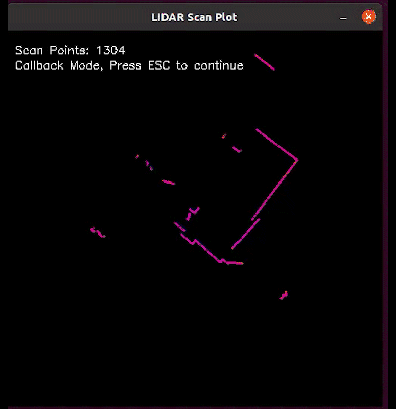

# SLAMTEC Aurora Remote SDK and Demo

[English Version](README.md)


本代码库包含使用SLAMTEC Aurora Remote SDK的演示代码和项目框架。

## 先决条件
- SLAMTEC Aurora 设备
- 设备与主机之间的 WiFi 或以太网连接

## 构建先决条件
- CMake 3.12 或更高版本
- C++14 编译器 (gcc 7.5 或更高版本, MSVC 2019 或更高版本, clang 8 或更高版本)
- 纯 C 可以用任何支持 C11 的 C 编译器编译 (但无法使用SDK中C++的功能)
- OpenCV 4.2 或更高版本 (如果您想编译使用 OpenCV 的例子程序)


## 用于ROS
- SLAMTEC官方提供Aurora的ROS包装节点，支持ROS 1和ROS 2。
- 您可以在SLAMTEC Aurora网站上找到这些包装节点。([ROS Wrapper Nodes](https://developer.slamtec.com/docs/slamware/aurora_ros2_sdk/))
- 一些Aurora特有的功能在ROS包装节点中不受支持，例如自动楼层检测。
- 如果您想使用Aurora特有的功能，您需要使用Remote SDK。

## 关于 Remote SDK 和 SLAMWARE SDK
- Remote SDK 是一个独立的库,可用于检索 SLAMTEC Aurora 特有的数据,如点云、地图和里程计。
- SLAMWARE SDK 是一个更通用的库,可用于控制所有 SLAMTEC 产品,如 SLAMKIT、SLAMWARE、Apollo 机器人平台、A1/A2/A3 系列,并为建图、定位和导航等任务提供更高级的 API。
- 目前,如果您想从 SLAMTEC Aurora 检索 3D 点云数据,您需要使用 Remote SDK。
- 对于未来的 SLAMWARE SDK 版本,我们将在 SLAMWARE SDK 中添加 Aurora 的 API。

## 您是否尝试过 SLAMTEC 官方工具?
我们强烈建议您首先使用 SLAMTEC 官方工具以获得更好的评估和开发体验。
- Aurora Remote App

- RoboStudio


它们可以从以下链接下载:
- [SLAMTEC Aurora 网站](https://www.slamtec.com/cn/Aurora) 
- [RoboStudio](https://www.slamtec.com/en/RoboStudio)

## Remote SDK API 参考文档
- [Remote SDK API Reference](doc/html/index.html)
这是Remote SDK的API参考。它包含所有函数在Remote SDK中的函数原型、参数描述和返回值。


## 构建演示的步骤
1. 克隆仓库及其子模块：
    ```
    git clone --recurse-submodules https://github.com/Slamtec/aurora_remote_sdk_demo.git
   
2. （可选）安装使用OpenCV的演示所需的依赖：
  
   例如，在Ubuntu上：
   ```
   sudo apt-get install -y libopencv-dev
   ```

3. 使用CMake构建演示。

    ```
    # 导航到源代码目录
    mkdir build
    cd build
    cmake ..
    make
    ```
4. 运行演示。


## 如何在目标机器上部署SDK
- 预编译的库仅依赖于C++标准库，因此可以部署在任何支持C++14的机器上。
- 对于Linux平台，还需确保glibc版本为2.31或更高。

## 关于演示程序
### map_render

- 这个演示展示了如何渲染来自Aurora设备的VSLAM地图数据。
- 它将订阅设备的地图数据、关键帧数据和地图点数据，并在屏幕上渲染地图、关键帧和地图点。
- 地图将以垂直视图渲染，关键帧将渲染在地图上。
- 此演示需要OpenCV。

### frame_preview

- 这个演示展示了如何从Aurora设备订阅跟踪帧和原始相机图像。
- 此演示需要OpenCV。


### lidar_scan_plot

- 这个演示展示了如何获取Aurora自带的2D激光雷达的扫描数据并进行渲染显示。
- 提供了两种数据获取方式
   1. 通过回调函数
   2. 通过轮询
- 激光雷达扫描点的信号强度信息（RSSI）也可以被获取并进行了显示
- 此演示需要OpenCV。


### lidar_2dmap_render

- 这个演示展示了如何从Aurora设备获取同步的激光2D栅格地图并进行实时渲染显示。
- 同时，自动楼层检测功能也被启用。
- 此演示需要OpenCV。


### simple_pose
```
Aurora SDK Version: 1.1.0-rc1
Device connection string not provided, try to discover aurora devices...
Waiting for aurora devices...
Found 1 aurora devices
Device 0
  option 0: tcp/[fe80::ad94:89de:cef2:dcb4]:7447
  option 1: tcp/192.168.1.212:7447
Selected first device: 
Connecting to the selected device...
Connected to the selected device
Current pose: 0, 0, 0 Euler: 0, 0, 0
Current pose: -33.4066, 72.7162, 0.946953 Euler: -1.55303, -0.0350474, -0.506329
Current pose: -33.3551, 72.8021, 0.941662 Euler: -1.5259, -0.0374291, -0.504501
Current pose: -33.3551, 72.8021, 0.941662 Euler: -1.5259, -0.0374291, -0.504501
Current pose: -33.2553, 72.9822, 0.962029 Euler: -1.49077, -0.0652254, -0.45777
Current pose: -33.2125, 73.0723, 0.976967 Euler: -1.52022, -0.0478041, -0.425694
Current pose: -33.1693, 73.1591, 0.983566 Euler: -1.54432, -0.0495824, -0.389488
Current pose: -33.1236, 73.2395, 0.972832 Euler: -1.51365, -0.0605495, -0.412273
```

- 这个演示展示了如何从Aurora设备获取当前位姿。

### vslam_map_saveload
```
Defaulting to download
Trying to discover and select aurora device...
Found 1 aurora devices
Device 0
  option 0: tcp/[fe80::ad94:89de:cef2:dcb4]:7447
  option 1: tcp/192.168.1.212:7447
Selected first device: 
Downloading vslam map to auroramap.asb
Downloading vslam map 6.67%
```
- 这个演示展示了如何从Aurora设备保存和加载地图。
- 它可以作为一个命令行工具来保存和加载地图。


### imu_fetcher
```
IMU Data: Accel: -0.941162, 0.406982, -0.0390625 Gyro: 1.95312, 4.08936, -1.2207
IMU Data: Accel: -0.9375, 0.407593, -0.0388184 Gyro: 2.2583, 3.84521, -1.64795
IMU Data: Accel: -0.936646, 0.407715, -0.0360107 Gyro: 2.68555, 3.35693, -2.19727
IMU Data: Accel: -0.934448, 0.405762, -0.0372314 Gyro: 2.86865, 3.11279, -2.62451
IMU Data: Accel: -0.933716, 0.40686, -0.0350342 Gyro: 3.05176, 2.80762, -2.74658
IMU Data: Accel: -0.934082, 0.406494, -0.0325928 Gyro: 3.11279, 2.74658, -2.62451
IMU Data: Accel: -0.938843, 0.407959, -0.0310059 Gyro: 3.11279, 2.99072, -2.44141
IMU Data: Accel: -0.936157, 0.406006, -0.0313721 Gyro: 3.23486, 3.23486, -2.31934
IMU Data: Accel: -0.938721, 0.402832, -0.026123 Gyro: 3.35693, 3.54004, -2.0752
IMU Data: Accel: -0.936279, 0.403931, -0.0252686 Gyro: 3.17383, 3.78418, -2.01416
IMU Data: Accel: -0.936768, 0.40332, -0.0247803 Gyro: 3.05176, 4.02832, -1.77002
```
- 这个演示展示了如何从Aurora设备订阅IMU数据。

### pure_c_demo
- 这个演示展示了如何使用Aurora Remote SDK的纯C代码。
