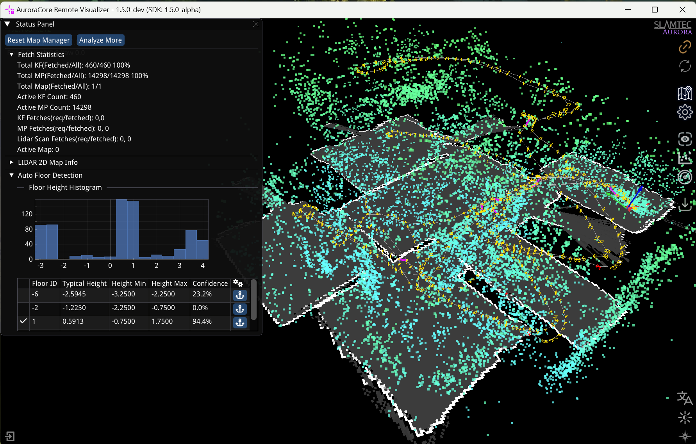

# SLAMTEC Aurora Remote SDK and Demo

[English Version](README.md)


本代码库包含使用SLAMTEC Aurora Remote SDK的演示代码和项目框架。

## 先决条件
- SLAMTEC Aurora 设备
- 设备与主机之间的 WiFi 或以太网连接

## 构建先决条件
- CMake 3.12 或更高版本
- C++14 编译器 (gcc 7.5 或更高版本, MSVC 2019 或更高版本, clang 8 或更高版本)
- 纯 C 可以用任何支持 C11 的 C 编译器编译 (但无法使用SDK中C++的功能)
- OpenCV 4.2 或更高版本 (如果您想编译使用 OpenCV 的例子程序)


## 用于ROS
- SLAMTEC官方提供Aurora的ROS包装节点，支持[ROS](https://github.com/Slamtec/aurora_ros) 和 [ROS2](https://github.com/Slamtec/aurora_ros/tree/ros2)。
- 您可以在SLAMTEC Aurora网站上找到这些包装节点。([ROS Wrapper Nodes](https://developer.slamtec.com/docs/slamware/aurora_ros2_sdk/))
- 一些Aurora特有的功能在ROS包装节点中不受支持，例如自动楼层检测。
- 如果您想使用Aurora特有的功能，您需要使用Remote SDK。

## 关于 Remote SDK 和 SLAMWARE SDK
- Remote SDK 是一个独立的库,可用于检索 SLAMTEC Aurora 特有的数据,如点云、地图和里程计。
- SLAMWARE SDK 是一个更通用的库,可用于控制所有 SLAMTEC 产品,如 SLAMKIT、SLAMWARE、Apollo 机器人平台、A1/A2/A3 系列,并为建图、定位和导航等任务提供更高级的 API。
- 目前,如果您想从 SLAMTEC Aurora 检索 3D 点云数据,您需要使用 Remote SDK。
- 对于未来的 SLAMWARE SDK 版本,我们将在 SLAMWARE SDK 中添加 Aurora 的 API。

## 您是否尝试过 SLAMTEC 官方工具?
我们强烈建议您首先使用 SLAMTEC 官方工具以获得更好的评估和开发体验。
- Aurora Remote App


它们可以从以下链接下载:
- [SLAMTEC Aurora 网站](https://www.slamtec.com/cn/Aurora) 

## Remote SDK API 参考文档
- [Remote SDK API Reference](doc/html/index.html)
这是Remote SDK的API参考。它包含所有函数在Remote SDK中的函数原型、参数描述和返回值。


## 构建演示的步骤
1. 克隆仓库及其子模块：
    ```
    git clone --recurse-submodules https://github.com/Slamtec/aurora_remote_sdk_demo.git
   
2. （可选）安装使用OpenCV的演示所需的依赖：
  
   例如，在Ubuntu上：
   ```
   sudo apt-get install -y libopencv-dev
   ```

3. 使用CMake构建演示。

    ```
    # 导航到源代码目录
    mkdir build
    cd build
    cmake ..
    make
    ```
4. 运行演示。


## 如何在目标机器上部署SDK
- 预编译的库仅依赖于C++标准库，因此可以部署在任何支持C++14的机器上。
- 对于Linux平台，还需确保glibc版本为2.31或更高。

## 关于演示程序

### 核心功能演示

#### simple_pose
- 基础演示，展示如何获取设备姿态（位置和方向）。
- [📖 详细说明](demo/simple_pose/README.zh-CN.md)

#### relocalization  
- 演示如何触发重定位以在已知地图中建立设备位置。
- [📖 详细说明](demo/relocalization/README.zh-CN.md)

#### pure_c_demo
- 不使用 C++ 包装器依赖的纯 C 实现。
- [📖 详细说明](demo/pure_c_demo/README.zh-CN.md)


### 增强成像演示（SDK 2.0）

#### depthcam_view
- 深度相机可视化，具有 3D 点云导出功能。
- 需要 OpenCV。
- [📖 详细说明](demo/depthcam_view/README.zh-CN.md)

#### semantic_segmentation

- 实时语义分割，具有交互式可视化和模型切换。
- 需要 OpenCV。
- [📖 详细说明](demo/semantic_segmentation/README.zh-CN.md)


### 传感器数据演示

#### imu_fetcher
- 实时 IMU（加速度计和陀螺仪）数据检索和显示。
- [📖 详细说明](demo/imu_fetcher/README.zh-CN.md)

#### frame_preview

- 捕获和显示跟踪帧和原始立体相机图像。
- 需要 OpenCV。
- [📖 详细说明](demo/frame_preview/README.zh-CN.md)

#### lidar_scan_plot
  
- 实时 LiDAR 扫描可视化，包含距离和质量数据。
- 需要 OpenCV。
- [📖 详细说明](demo/lidar_scan_plot/README.zh-CN.md)

### 地图和可视化演示

#### map_render

- 渲染 VSLAM 地图数据，包括关键帧和地图点。
- 需要 OpenCV。
- [📖 详细说明](demo/map_render/README.zh-CN.md)

#### lidar_2dmap_render

- 从 LiDAR 数据生成和可视化 2D 占用栅格地图。
- 需要 OpenCV。
- [📖 详细说明](demo/lidar_2dmap_render/README.zh-CN.md)

#### vslam_map_saveload
- 用于下载/上传 VSLAM 地图到/从设备的命令行工具。
- [📖 详细说明](demo/vslam_map_saveload/README.zh-CN.md)


### 校准和设备信息演示（SDK 2.0）

#### calibration_exporter
- 用于导出相机和变换校准数据的命令行工具。
- 需要 OpenCV。
- [📖 详细说明](demo/calibration_exporter/README.zh-CN.md)

#### device_info_monitor
- 设备基本信息和状态的实时监控。
- [📖 详细说明](demo/device_info_monitor/README.zh-CN.md)
