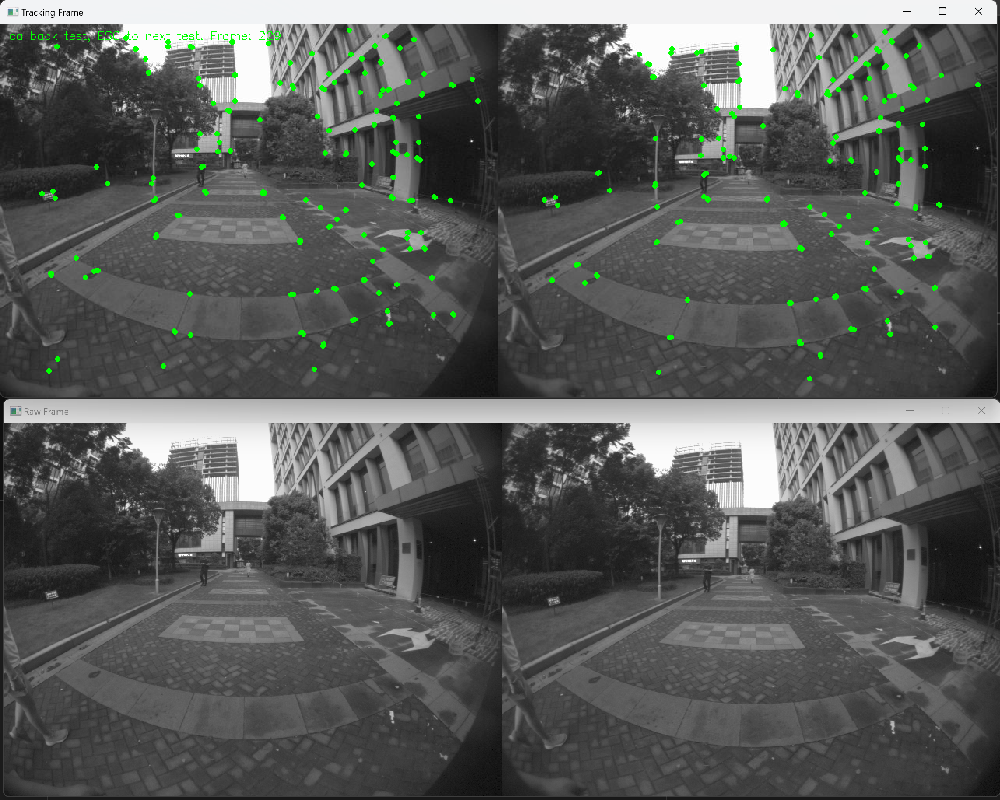

# Aurora 帧预览演示



本演示展示如何使用 OpenCV 可视化从 Aurora 设备捕获和显示跟踪帧和原始相机帧。

## 功能特性

- **实时帧显示**: 显示跟踪帧和原始立体相机图像
- **双相机支持**: 显示左右相机数据流
- **跟踪可视化**: 渲染跟踪特征和关键点
- **事件驱动处理**: 使用 SDK 监听器进行高效帧处理

## 系统要求

- 带有相机系统的 Aurora 设备
- Aurora Remote SDK
- OpenCV 4.2 或更高版本
- 主机与 Aurora 设备之间的网络连接

## 使用方法

```bash
# 自动发现并连接
./frame_preview

# 连接到特定设备
./frame_preview tcp://192.168.1.100:8090
```

## 关键功能

- **跟踪帧可视化**: 显示用于 SLAM 的视觉特征
- **原始相机帧**: 显示未处理的立体相机图像
- **实时更新**: 最小延迟的帧率可视化
- **线程安全处理**: 使用互斥锁保护并发数据访问

## 集成示例

```cpp
#include "aurora_pubsdk_inc.h"
#include <opencv2/opencv.hpp>

class FrameListener : public RemoteSDKListener {
public:
    void onTrackingData(const RemoteTrackingFrameInfo& info) override {
        // 处理跟踪帧数据
        std::cout << "Tracking frame received" << std::endl;
    }
    
    void onRawCamImageData(uint64_t timestamp_ns, 
                          const RemoteImageRef& left, 
                          const RemoteImageRef& right) override {
        // 处理原始相机图像
        cv::Mat leftImage, rightImage;
        left.toMat(leftImage);
        right.toMat(rightImage);
        
        cv::imshow("Left Camera", leftImage);
        cv::imshow("Right Camera", rightImage);
    }
};
```

## 使用场景

- **相机校准**: 相机对齐的视觉验证
- **系统调试**: 跟踪性能的实时监控
- **开发**: SLAM 算法开发期间的视觉反馈
- **质量保证**: 相机功能的验证