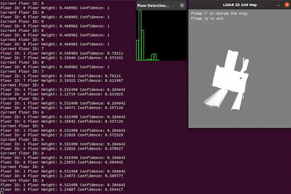

# Aurora LiDAR 2D Map Render Demo



This demo demonstrates how to generate and visualize 2D occupancy grid maps from LiDAR data using Aurora devices.

## Features

- **2D Grid Map Generation**: Creates occupancy grid maps from LiDAR scans
- **Real-time Rendering**: Live visualization of map building process
- **Occupancy Visualization**: Shows free, occupied, and unknown areas
- **Map Export**: Save generated maps for later use

## Requirements

- Aurora device with LiDAR sensor
- Aurora Remote SDK
- OpenCV 4.2 or higher
- Network connection

## Usage

```bash
# Auto-discover and render 2D map
./lidar_2dmap_render

# Connect to specific device
./lidar_2dmap_render tcp://192.168.1.100:8090
```

## Key Features

- **Occupancy Grid Generation**: Creates probabilistic occupancy maps
- **Multi-resolution Support**: Different map resolutions
- **Color Coding**: Visual representation of occupancy probabilities
- **Map Statistics**: Size, resolution, and coverage information

## Use Cases

- **Navigation Planning**: Generate maps for path planning
- **Environment Mapping**: Create 2D representations of spaces
- **Obstacle Detection**: Identify free and occupied areas
- **Map Building**: Real-time SLAM mapping visualization