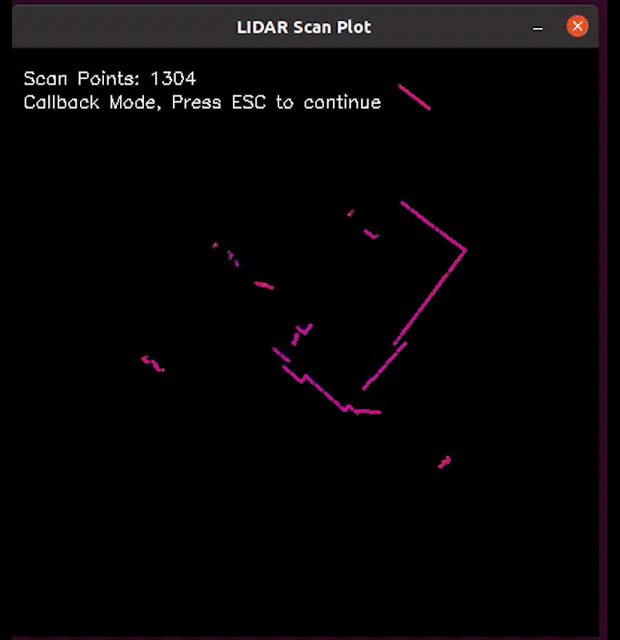

# Aurora LiDAR Scan Plot Demo



This demo demonstrates how to retrieve and visualize LiDAR scan data from Aurora devices using OpenCV plotting.

## Features

- **Real-time LiDAR Visualization**: Displays live LiDAR scan points
- **2D Plot Rendering**: Shows LiDAR data in top-down view
- **Distance Measurements**: Color-coded distance visualization
- **Scan Rate Monitoring**: Displays scan frequency and statistics

## Requirements

- Aurora device with LiDAR sensor
- Aurora Remote SDK
- OpenCV 4.2 or higher
- Network connection

## Usage

```bash
# Auto-discover and plot LiDAR scans
./lidar_scan_plot

# Connect to specific device
./lidar_scan_plot tcp://192.168.1.100:8090
```

## Key Features

- **Point Cloud Display**: Real-time LiDAR point visualization
- **Range Information**: Distance and angle data
- **Color Mapping**: Distance-based color coding
- **Scan Statistics**: Frame rate and point count monitoring

## Use Cases

- **Sensor Verification**: LiDAR functionality testing
- **Environment Analysis**: Real-time obstacle detection
- **Development**: LiDAR data debugging
- **Calibration**: Sensor alignment verification